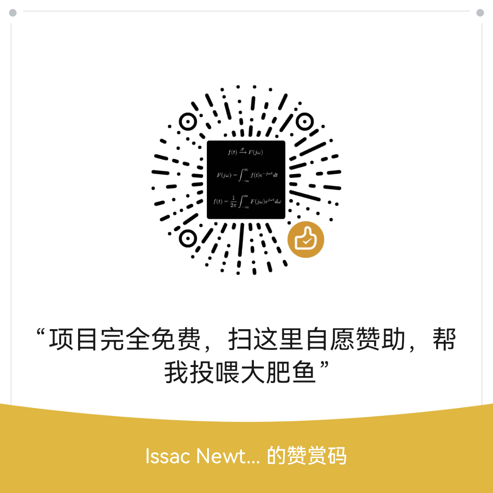

# 西语动词变位练习器 2.0 · Spanish Verb Conjugation Trainer

## 写在前面
- 本人是一位西语小白，目前正处于被西语动词变位折磨的状态，发现网上的西语变位训练app/软件要么是付费的，要么练习不够到位。本着敢为天下先的理念，我直接就是一个vibe coding，很快啊。经过和大肥鱼的十几次周旋，处理了几十个bug和不满意之处，终于，集入门、训练、词典于一身的西语动词变位练习器1.0诞生了。
- 2.0 在 1.0 的基础上全面换装：按钮、难度档、模式选择统一用上了 Lucide 开源矢量图标，预设系统改名并重新打磨，自定义槽的体验也对齐了预设。欢迎继续提建议！
- 目前虽然有英文模式，但是还没有来得及看排版，如果外国友人对排版有什么建议，我会很乐意继续修改。 Although there is already an English mode, I currently don't have enough time to check its layout. If any native English speaker has any suggestions, I would be willing to fix them in the future.

- ## 💝 支持本项目
如果本项目对你有帮助，可以请作者的大肥鱼吃高级鱼饲料，所有赞助全部用于项目维护。
> 提示：**纯属自愿赞助，项目本身完全免费，不会因为不赞助而限制任何功能**。

| 微信赞赏 | 
|:--------:|
||

**中文** ｜ [English](#english)

> **AI 参与声明 / AI Disclosure**：本作品在开发过程中使用了 GPT（生成式 AI）辅助参与代码编写、测试与文档撰写，并经人工设计、审校与验证。/ This project was developed with the assistance of GPT (generative AI) for code, testing, and documentation, with human design, review, and verification.

---

## 中文

一个**单文件、离线**的西班牙语动词变位训练器：整个程序就是一个 HTML 文件，双击用浏览器打开即可练习——不安装、不联网、不注册，答题记录全部保存在本地。

### ✨ 特性

- **单文件即开即练**：一个约 1 MB 的 HTML，U盘、微信、邮件随便传；无任何外部依赖（脚本、字体、样式全部内联）。
- **487 个精选动词**：覆盖 A1–C2 六个等级（A1 72 / A2 97 / B1 107 / B2 151 / C1 35 / C2 25），含 30 个常用自复动词；按等级勾选，题库范围由你定。
- **15 个时态**：陈述式（现在 / 过去未完成 / 简单过去 / 将来 / 条件式 / 各复合时态）、虚拟式（现在 / 未完成 -ra / -se）、命令式（肯定 / 否定），任意勾选组合出题。
- **4 种练习模式**，从认读到默写层层递进，每种都配有 Lucide 矢量图标：
  | 模式 | 图标 | 玩法 |
  |---|:---:|---|
  | 👁 辨认 Recognition | `eye` | 看一个变位形式，判断它是哪个人称 |
  | ✏ 复现 Production | `pencil` | 给出人称与时态，直接写出变位 |
  | 🔄 转换 Tense shift | `repeat` | 同一个动词、同一个人称，只换时态 |
  | ⇄ 平移 Verb transfer | `transfer` | 人称时态不变，照 A 动词写出 B 动词 |
- **一键预设，5 秒开练**：四套难度档一键套用整套设置并立即出题，每档配独立图标：
  | 难度档 | 图标 | 内容 |
  |---|:---:|---|
  | 🌱 零基础 · A1 起步 | `sprout` | A1 词库 · 现在时 · 选择题 |
  | 🌳 入门 · A2 三时态 | `tree-deciduous` | A1–A2 词库 · 现在 / 简单过去 / 未完成 · 手写 |
  | 🚀 进阶 · B1 八时态 | `rocket` | A2–B1 词库 · 8 个时态 · 手写 |
  | 🏆 考试冲刺 · B2 全时态 | `trophy` | A1–B2 词库 · 全部 15 个时态 · 手写 |
- **2 个自定义槽**（`wrench` / `puzzle`）：词库、时态、答题方式自由组合，改动实时保存；点选自定义槽即展开与预设同款的只读摘要（词库 / 时态 / 其它），点右侧「编辑」按钮弹出模态窗口调整。
- **只染真正变化的字母**：`pienso` 只标 `ie`、`practiqué` 只标 `qu`、`tengo` 只标 `g`。三色对应三类不规则——不规则（红）/ 正字法变化（青）/ 词干变化（橙），看答案的同时看懂"哪里变了"。
- **讲道理的判分**：少打一个重音符不会直接判错，而是提示"重音有误"让你确认；严格重音模式在齿轮设置里全局控制。
- **右栏变位表抽屉**：随拉随查任意动词的完整变位，与练习答案同款渲染，可一键定位到当前题目对应的时态；浮层设计不影响正文阅读。
- **8 页语法讲解**：四种过去时、命令式代词位置、虚拟语气、正字法、词根变化、重音规则……所有变位例子都是与练习一致的六人称表格，关键处附 RAE 官方外链。
- **错题本与统计**：按动词 / 时态 / 模式统计正确率，错题自动进错题本（保留最近 300 条），支持一键"只练错题"。
- **中英双语界面**：一键切换，可自动跟随浏览器语言。
- **隐私友好**：所有数据只存在浏览器 localStorage，不采集、不上传任何信息。

### 🎨 矢量图标

2.0 全面采用 [Lucide Icons](https://lucide.dev)（ISC License，线性风格）作为界面图标语言，涵盖练习模式、难度档、自定义槽与设置按钮。图标以 SVG 内联进 HTML，保持单文件离线特性；同一套 24×24 网格、2px 线宽、圆角端点，风格高度统一。源文件保存在 `icon/` 目录，见 [icon/README.md](icon/README.md)。

### 🚀 快速开始

1. 下载 `西语动词变位练习器.html`（右侧 Releases 或直接下载本仓库根目录文件）；
2. 双击用浏览器打开（Chrome / Edge / Firefox 均可）；
3. 点一个难度档（如「零基础 · A1 起步」）即可直接开练，或继续勾时态、挑模式。

就这么简单。想换设备学习？把文件拷走即可，记录存在浏览器里，同一台电脑下次打开自动恢复。

> 想在手机平板上用？把文件发给自己，用浏览器打开同样可用（界面已适配窄屏）。

### 🎯 推荐练习路径

1. **初学（A1–A2）**：点「零基础」或「入门」预设，用「辨认」熟悉形式 → 切「复现」开始默写；
2. **进阶（B1–B2）**：点「进阶」预设，用「转换」专攻时态区分；
3. **冲刺（C1–C2）**：点「考试冲刺」预设 + 「隐藏原形」+「只练错题」，在齿轮设置里开启严格重音判定模拟考试。

### 🗂 仓库结构

```
├── 西语动词变位练习器.html   ← 成品（双击即用，无需构建）
├── curate.txt                ← 词表白名单（原形|等级|中文释义）
├── icon/                     ← Lucide 矢量图标（SVG 源文件 + 说明）
├── 工程介绍.md               ← 开发者向工程文档
├── data/
│   ├── jehle_parsed.json     ← 变位源数据（637 动词）
│   ├── build_final.py        ← 从白名单筛词、生成 verbs_data.json
│   ├── build_app.py          ← 把数据注入模板，产出最终 HTML
│   ├── app_template.html     ← 应用模板（唯一手改的源码）
│   └── run_tests.py          ← 一键回归：数据层 + 冒烟 + 无头浏览器交互测试
└── ...
```

成品已预构建，普通用户**不需要跑任何构建命令**。想增删动词：编辑 `curate.txt` 后依次运行 `build_final.py`、`build_app.py` 即可（或直接跑 `data/run_tests.py` 一键重建 + 全量回归）。

### 🧪 质量

内置三层自动化回归（`data/run_tests.py`）：

- **数据层**（105 项）：等级合法性、自复动词变位完整性、判定与着色码正确性；
- **冒烟测试**（79 项，Node）：核心函数与数据不变量；
- **交互测试**（692 项，无头浏览器）：四种模式出题作答、判分与反馈、抽屉 / 讲解页 / 统计页、界面稳定性（题干高度恒定、着色只染变化字母等像素级断言）。

### 📚 数据来源与许可

- 变位数据基于 [Jehle 的西班牙语动词数据库](https://github.com/ghidinelli/free-jehle-spanish-verbs)（CC BY-NC-SA 3.0），经清洗、筛选、标注等级后使用，仅用于非商业学习用途；
- 界面图标来自 [Lucide Icons](https://lucide.dev)（ISC License）；
- 语法讲解中的外链指向 RAE（西班牙皇家语言学院）等权威参考；
- 本作品由人工与 GPT（生成式 AI）协作完成，代码与文案欢迎学习交流，转载请注明出处。

### ⚠️ 已知边界

- 无人称动词（llover / nevar 等）因缺少完整人称形式，未收录；
- 答案判定支持多重读法（如虚拟式 -ra/-se 互换均判对），但不覆盖方言变体（如 voseo）；
- `vosotros` 可在设置中关闭（拉美学习者常用）。

---

## English

A **single-file, offline** Spanish verb conjugation trainer: the whole app is one HTML file — just open it in your browser and start drilling. No install, no network, no account; all your progress is stored locally.

### ✨ Features

- **One file, instant start**: a ~1 MB HTML you can carry on a USB stick or send over chat; zero external dependencies (all scripts, fonts and styles are inlined).
- **487 curated verbs** across six levels (A1 72 / A2 97 / B1 107 / B2 151 / C1 35 / C2 25), including 30 common reflexive verbs; pick your level to define the question pool.
- **15 tenses**: indicative (present, imperfect, preterite, future, conditional, compound tenses), subjunctive (present, imperfect -ra/-se), imperative (affirmative & negative) — tick any combination.
- **4 drill modes**, from recognition to recall, each with its own Lucide icon:
  | Mode | Icon | What you do |
  |---|:---:|---|
  | Recognition | `eye` | See one conjugated form and tell which person it is |
  | Production | `pencil` | Given a person and a tense, write the form |
  | Tense shift | `repeat` | Same verb and person — switch to another tense |
  | Verb transfer | `transfer` | Same person and tense — switch to another verb |
- **One-click presets, drilling in 5 seconds**: each preset applies a full setup and starts immediately, with its own icon:
  | Preset | Icon | What it sets |
  |---|:---:|---|
  | Starter · A1 | `sprout` | A1 verbs · present · multiple choice |
  | Building · A2 | `tree-deciduous` | A1–A2 verbs · present / preterite / imperfect · type it |
  | Advancing · B1 | `rocket` | A2–B1 verbs · 8 tenses · type it |
  | Exam sprint · B2 | `trophy` | A1–B2 verbs · all 15 tenses · type it |
- **2 custom slots** (`wrench` / `puzzle`): combine levels, tenses and input modes freely; changes are saved live. Clicking a custom slot shows the same read-only summary as presets (library / tenses / other); the “Edit” button opens a modal to adjust it.
- **Highlights only what actually changes**: `pienso` marks only `ie`, `practiqué` only `qu`, `tengo` only `g`. Three colors map to three irregularity types — irregular (red) / spelling change (cyan) / stem change (orange).
- **Fair grading**: missing an accent won't fail you outright — the app asks you to confirm "accent issue"; strict accent grading is a global toggle in the gear settings.
- **Conjugation drawer**: slide out the right-hand panel to look up any verb's full conjugation, rendered exactly like the practice answers, and jump straight to the tense in play — without disturbing your reading.
- **8-page grammar guide**: the four past tenses, pronoun placement in the imperative, the subjunctive, spelling changes, stem changes, written accents… every example is the same six-person grid used in practice, with links to official RAE references.
- **Mistake log & stats**: accuracy by verb / tense / mode; wrong answers go into a mistake log (last 300 kept) with a one-click "drill my mistakes only" mode.
- **Bilingual UI** (中文 / English): one click to switch, or auto-detect from the browser.
- **Privacy-friendly**: everything stays in your browser's localStorage — nothing is collected or uploaded.

### 🎨 Vector icons

2.0 adopts [Lucide Icons](https://lucide.dev) (ISC License, line style) as the interface icon language across drill modes, presets, custom slots and settings. Icons are inlined as SVG so the app stays a single offline file; they share one 24×24 grid, 2px stroke and round caps for a consistent look. SVG sources live in `icon/` — see [icon/README.md](icon/README.md).

### 🚀 Quick start

1. Download `西语动词变位练习器.html` (from Releases or this repo's root);
2. Double-click to open it in a browser (Chrome / Edge / Firefox all work);
3. Click a preset (e.g. “Starter · A1”) to start drilling right away — or fine-tune tenses and mode first.

That's it. Moving devices? Just copy the file. Progress lives in the browser and restores automatically on the same machine.

> Works on phones and tablets too — send the file to yourself and open it in a mobile browser (the layout adapts to narrow screens).

### 🎯 Suggested practice path

1. **Beginner (A1–A2)**: the *Starter* or *Building* preset; use *Recognition* to get familiar, then switch to *Production*;
2. **Intermediate (B1–B2)**: the *Advancing* preset; use *Tense shift* to separate the past tenses;
3. **Advanced (C1–C2)**: the *Exam sprint* preset + "hide the infinitive" + "drill mistakes only", with strict accent grading turned on in the gear settings — great exam simulation.

### 🗂 Repository layout

```
├── 西语动词变位练习器.html   ← the app (ready to use, no build needed)
├── curate.txt                ← verb whitelist (infinitive|level|meaning)
├── icon/                     ← Lucide vector icons (SVG sources + notes)
├── 工程介绍.md               ← developer-facing project guide
├── data/
│   ├── jehle_parsed.json     ← source conjugation data (637 verbs)
│   ├── build_final.py        ← filter whitelist → verbs_data.json
│   ├── build_app.py          ← inject data into the template → final HTML
│   ├── app_template.html     ← the app template (the only hand-edited source)
│   └── run_tests.py          ← one-shot regression: data + smoke + headless UI tests
└── ...
```

The app ships pre-built — **no build step required**. To add or remove verbs: edit `curate.txt`, then run `build_final.py` and `build_app.py` (or simply run `data/run_tests.py` to rebuild and run the full regression).

### 🧪 Quality

Three layers of automated regression (`data/run_tests.py`):

- **Data layer** (105 checks): level validity, reflexive conjugation completeness, judging & highlight codes;
- **Smoke tests** (79 checks, Node): core functions and data invariants;
- **Interaction tests** (692 checks, headless browser): all four drill modes end-to-end, grading & feedback, drawer / guide / stats pages, UI stability (constant prompt height, highlight confined to changed letters, etc.).

### 📚 Data source & license

- Conjugation data is based on [Jehle's Spanish verb database](https://github.com/ghidinelli/free-jehle-spanish-verbs) (CC BY-NC-SA 3.0), cleaned, filtered and level-tagged; non-commercial educational use only;
- Interface icons come from [Lucide Icons](https://lucide.dev) (ISC License);
- External links in the grammar guide point to the RAE (Real Academia Española) and other authoritative references;
- This work was created by a human in collaboration with GPT (generative AI). Code and text are shared for learning purposes — please attribute when redistributing.

### ⚠️ Known limitations

- Impersonal verbs (llover, nevar, …) are excluded for lack of full person forms;
- Judging accepts multiple valid readings (e.g. subjunctive -ra/-se are interchangeable) but does not cover regional variants such as voseo;
- `vosotros` can be turned off in settings (common preference for Latin-American Spanish learners).

---

*¡Ánimo y a conjugar!* 🇪🇸
